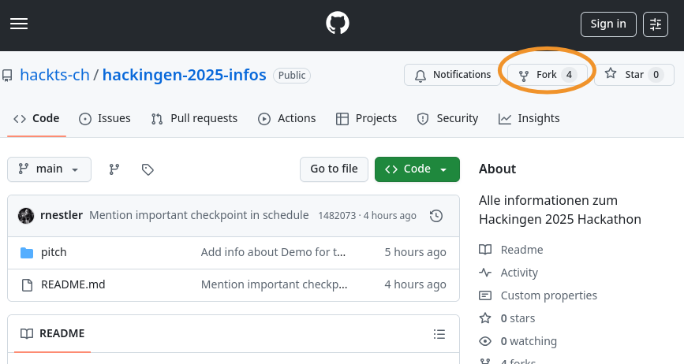
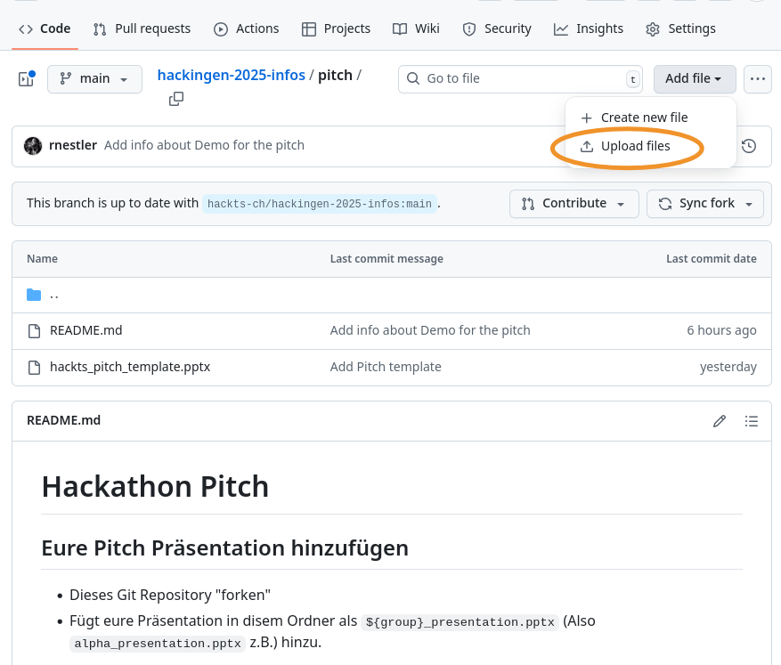
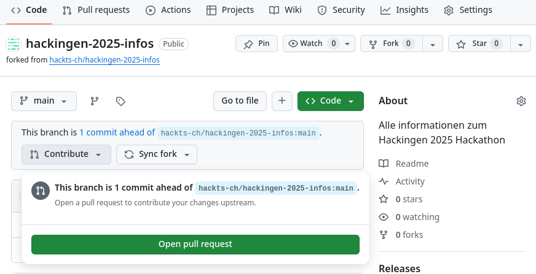

# Hackathon Pitch

## Eure Pitch Präsentation hinzufügen

 * Dieses Git Repository "forken"
   
   
 * Fügt eure Präsentation in diesem Ordner als `${group}_presentation.pptx` (Also `alpha_presentation.pptx` z.B.) hinzu.
   

 * Pull request zum originalen Repository erstellen
   

## Hinweise

 * Es geht darum die Jury zu überzeugen!
 * Stellt das Problem vor welches ihr lösen wollt
 * Zeigt eure Lösung dazu
 * Demonstriert euren Prototypen welcher einen Teil des Problems löst
 * Zeigt auf, was man noch alles machen könnte mit eurem Projekt
 * Demo
   * Wenn ihr etwas live deployed habt: Einfach den Link in der Präsentation hinterlegen
   * Sonst: Ein Screenrecording als video ist am einfachsten. Hinterlegen als `${group}_demo.mp4`
